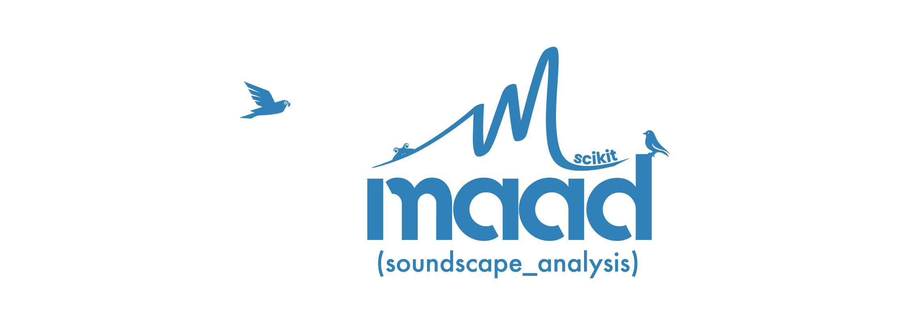

<div align="center">
    
</div>

**scikit-maad** is an open source Python package dedicated to the quantitative analysis of environmental audio recordings. This package was designed to (1) load and process digital audio, (2) segment and find regions of interest, (3) compute acoustic features, and (4) estimate sound pressure level. This workflow opens the possibility to scan large audio datasets and use powerful machine learning techniques, allowing to measure acoustic properties and identify key patterns in all kinds of soundscapes.

[](https://zenodo.org/badge/latestdoi/148142520)

## Installation
scikit-maad dependencies:

- Python >= 3.5
- NumPy >= 1.13
- SciPy >= 0.18
- scikit-image >= 0.14

**scikit-maad** is hosted on PyPI. To install, run the following command in your Python environment:

```bash
$ pip install scikit-maad
```

To install the latest version from source clone the master repository and from the top-level folder call:

```bash
$ python setup.py install
```

## Examples and documentation
- See https://scikit-maad.github.io for a complete reference manual and example gallery.
- In depth information related to the Multiresolution Analysis of Acoustic Diversity implemented in scikit-maad was published in: Ulloa, J. S., Aubin, T., Llusia, D., Bouveyron, C., & Sueur, J. (2018). [Estimating animal acoustic diversity in tropical environments using unsupervised multiresolution analysis](https://doi.org/10.1016/j.ecolind.2018.03.026). Ecological Indicators, 90, 346–355

## Citing this work

If you find scikit-maad usefull for your research, please consider citing it as:

- Ulloa, J. S., Haupert, S., Latorre, J. F., Aubin, T., & Sueur, J. (2021). scikit‐maad: An open‐source and modular toolbox for quantitative soundscape analysis in Python. Methods in Ecology and Evolution, 2041-210X.13711. https://doi.org/10.1111/2041-210X.13711

```bibtex

@article{ulloa_etal_scikitmaad_2021,
	title = {scikit‐maad: {An} open‐source and modular toolbox for quantitative soundscape analysis in {Python}},
	issn = {2041-210X, 2041-210X},
	shorttitle = {scikit‐maad},
	url = {https://onlinelibrary.wiley.com/doi/10.1111/2041-210X.13711},
	doi = {10.1111/2041-210X.13711},
	language = {en},
	urldate = {2021-10-04},
	journal = {Methods in Ecology and Evolution},
	author = {Ulloa, Juan Sebastián and Haupert, Sylvain and Latorre, Juan Felipe and Aubin, Thierry and Sueur, Jérôme},
	month = sep,
	year = {2021},
	pages = {2041--210X.13711},
}
````

## Contributions and bug report
Improvements and new features are greatly appreciated. If you would like to contribute developing new features or making improvements to the available package, please refer to our [wiki](https://github.com/scikit-maad/scikit-maad/wiki/How-to-contribute-to-scikit-maad). Bug reports and especially tested patches may be submitted directly to the [bug tracker](https://github.com/scikit-maad/scikit-maad/issues). 

## About the project
In 2018, we began to translate a set of audio processing functions from Matlab to an open-source programming language, namely, Python. These functions provided the necessary tools to replicate the Multiresolution Analysis of Acoustic Diversity (MAAD), a method to estimate animal acoustic diversity using unsupervised learning (Ulloa et al., 2018). We soon realized that Python provided a suitable environment to extend these core functions and to develop a flexible toolbox for our research. During the past few years, we added over 50 acoustic indices, plus a module to estimate the sound pressure level of audio events. Furthermore, we updated, organized, and fully documented the code to make this development accessible to a much wider audience. This work was initiated by [Juan Sebastian Ulloa](https://www.researchgate.net/profile/Juan_Ulloa), supervised by Jérôme Sueur and Thierry Aubin at the [Muséum National d'Histoire Naturelle](http://isyeb.mnhn.fr/fr) and the [Université Paris Saclay](http://neuro-psi.cnrs.fr/) respectively. Python functions have been added by [Sylvain Haupert](https://www.researchgate.net/profile/Sylvain_Haupert), [Juan Felipe Latorre](https://www.researchgate.net/profile/Juan_Latorre_Gil) ([Universidad Nacional de Colombia](https://unal.edu.co/)) and Juan Sebastián Ulloa ([Instituto de Investigación de Recursos Biológicos Alexander von Humboldt](http://www.humboldt.org.co/)).
